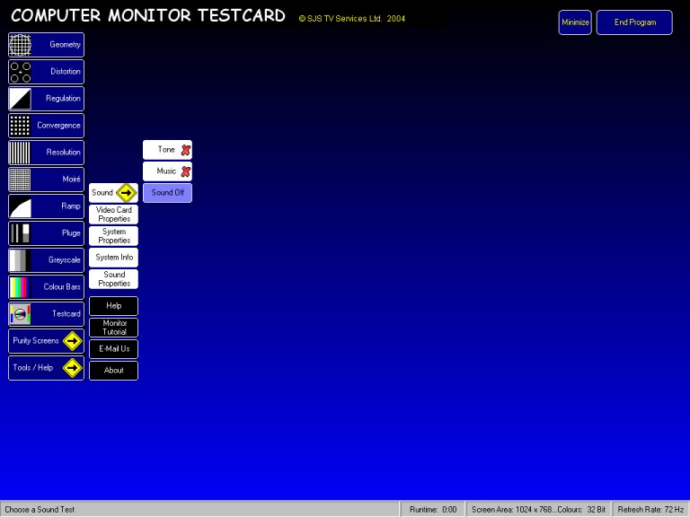



## Monitor Testcard

### Description

Use this program to set up your computer monitor and check for any errors. Comes complete with help files and a tutorial on the basics of monitors.

This is a complete program but I decided to reproduce it here as, if wasn't for the the nice people who use PSC, it wouldn't exist!

Please see the "Read Me First.txt" file before loading.

I do not really like the idea of requesting your vote but if you think this program is worth keeping and using (which you should for the health of your monitor), then please come back and say so. Many thanks.
 
### More Info
 

             |
---                |---
**Submitted On**   |2004-02-10 23:00:42
**By**             |[Stu\.](https://github.com/Planet-Source-Code/PSCIndex/blob/master/ByAuthor/stu.md)
**Level**          |Intermediate
**User Rating**    |5.0 (90 globes from 18 users)
**Compatibility**  |VB 6\.0
**Category**       |[Complete Applications](https://github.com/Planet-Source-Code/PSCIndex/blob/master/ByCategory/complete-applications__1-27.md)
**World**          |[Visual Basic](https://github.com/Planet-Source-Code/PSCIndex/blob/master/ByWorld/visual-basic.md)
**Archive File**   |[Monitor\_Te1706912102004\.zip](https://github.com/Planet-Source-Code/stu-monitor-testcard__1-51651/archive/master.zip)

